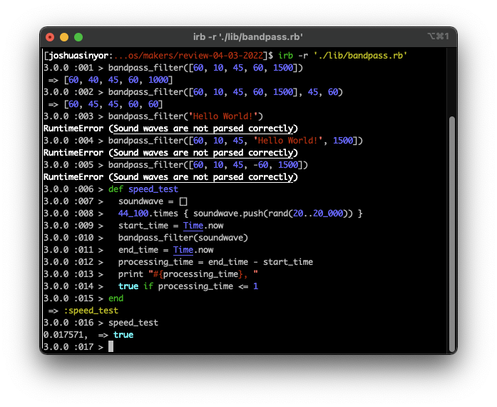

# Makers Review 2

This repository reflects Makers coding review 2, conducted 04/03/2022.

---

- [Installation](#installation)
- [Specification](#specification)
- [Acceptance Criteria](#acceptance-criteria)
  * [Input/Output Table](#input-output-table)
- [Final Appearance](#final-appearance)
- [Dependencies](#dependencies)
- [Author(s)](#author-s-)
- [License(s)](#license-s-)
- [Acknowledgements](#acknowledgements)

---

## Installation

This project requires Ruby 3.0.0. If you do not have Ruby 3.0.0, install it using [these instructions](https://www.ruby-lang.org/en/documentation/installation/).

1. [Clone](https://docs.github.com/en/github/creating-cloning-and-archiving-repositories/cloning-a-repository) or [fork](https://docs.github.com/en/github/getting-started-with-github/fork-a-repo) this repository.
2. Install the necessary Gems from the `Gemfile` by executing `bundle install`.

---

## Specification

1. This company employs musicians that make EDM. They apply filters to their tracks, changing how the tracks sound.
2. This program is a bandpass filter.
3. The filter takes a soundwave as an input (an array of numbers, each number representing a frequency).
4. Any frequency in the array lesser than the lower limit or greater than the upper limit must be set to the limit.
5. There should be a default lower limit of 40 and a default upper limit of 1,000.
6. The user should be able to override the default limits.
5. All frequencies within the limits should remain unchanged.
7. There may be a corrupted input which is not an array. If one is encountered, an error (`Sound waves are not parsed correctly`) should be raised.
8. There may be corrupted inputs within an array which are not positive integers. If this is encountered, the same error (`Sound waves are not parsed correctly`) should be raised.
9. This program needs to be run on streamed music, so it should process a full second of music (44,100 frequencies) in under 100ms.

---

## Acceptance Criteria

This program must:

1. [x] Upon input of `[60,10,45,60,1500]`, output `[60,40,45,60,1000]`.
2. [x] Upon input of something which is not an array, raise error `Sound waves are not parsed correctly`.
3. [x] Upon input of something within an array which is not a positive integer, raise error `Sound waves are not parsed correctly`.
4. [x] The program must be able to process a full second of music (44,100 frequencies) in under 100ms.

### Input/Output Table

| Input                                   | Output                                        |
|-----------------------------------------|-----------------------------------------------|
| [60, 10, 45, 60, 1500]                  | [60, 40, 45, 60, 1000]                        |
| ([50, 100, 500, 1100, 1150], 100, 1100) | [100, 100, 500, 1100, 1100]                   |
| `'Hello World!'`                        | Error  `Sound waves are not parsed correctly` |
| [60, 10, 45, 'Hello World!', 1500]      | Error  `Sound waves are not parsed correctly` |
| [60, 10, 45, -60, 1500]                 | Error  `Sound waves are not parsed correctly` |
| [ `44,100 entries` ]                    | [ `44,100 entries` ] in under 100ms.          |

---

## Final Appearance

This program is pictured below executing the instructions in the Acceptance Criteria.

---

## Dependencies

This program's dependencies are minimal and relate solely to testing. All dependencies are explicitly invoked in the `Gemfile`.

- [Ruby](https://www.ruby-lang.org/), courtesy of [Yukihiro Matsumoto](https://github.com/matz).
- [RSpec](https://rspec.info/), courtesy of [Jon Rowe](https://github.com/JonRowe), [Benoit Tigeot](https://github.com/benoittgt), [Phil Pirozhkov](https://github.com/pirj), [Xavier Shay](https://github.com/xaviershay) and [Yuji Nakayama](https://github.com/yujinakayama).
- [Rubocop](https://rubocop.org/) and [Rubocop-RSpec](https://github.com/rubocop/rubocop-rspec), both courtesy of [Bozhidar Batsov](https://github.com/bbatsov).
- [SimpleCov](https://github.com/simplecov-ruby/simplecov), courtesy of [Christoph Olszowka](https://github.com/colszowka).
- [SimpleCov-Console](https://github.com/chetan/simplecov-console), courtesy of [Chetan Sarva](https://github.com/chetan).

---

## Author(s)

Authored by [Joshua Sinyor](https://gist.github.com/JoshSinyor).

---

## License(s)

This project is licensed under the [MIT License](LICENSE).

---

## Acknowledgements

* Table of contents generated with [markdown-toc](https://ecotrust-canada.github.io/markdown-toc/).
* Markdown tables generated with [TablesGenerator](https://www.tablesgenerator.com/markdown_tables).
